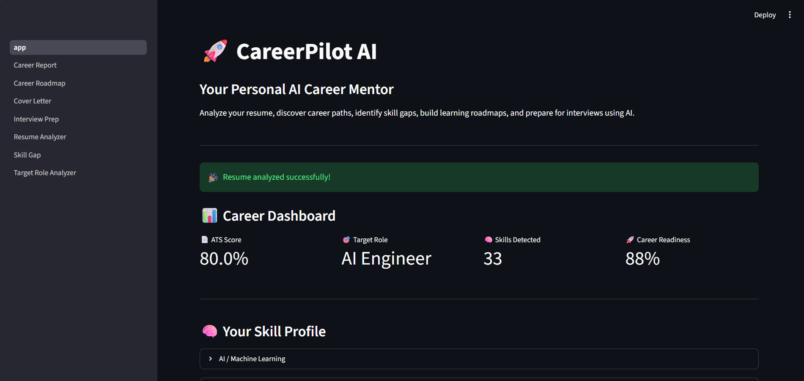
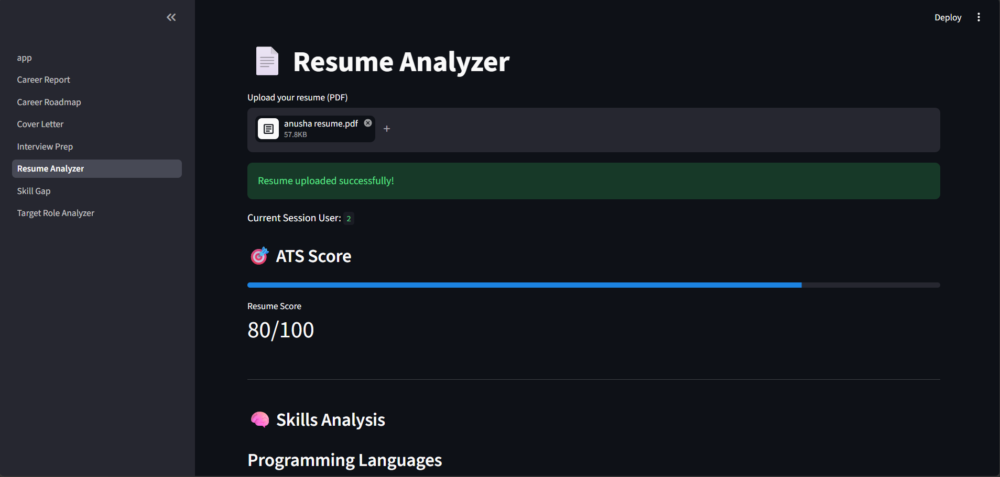
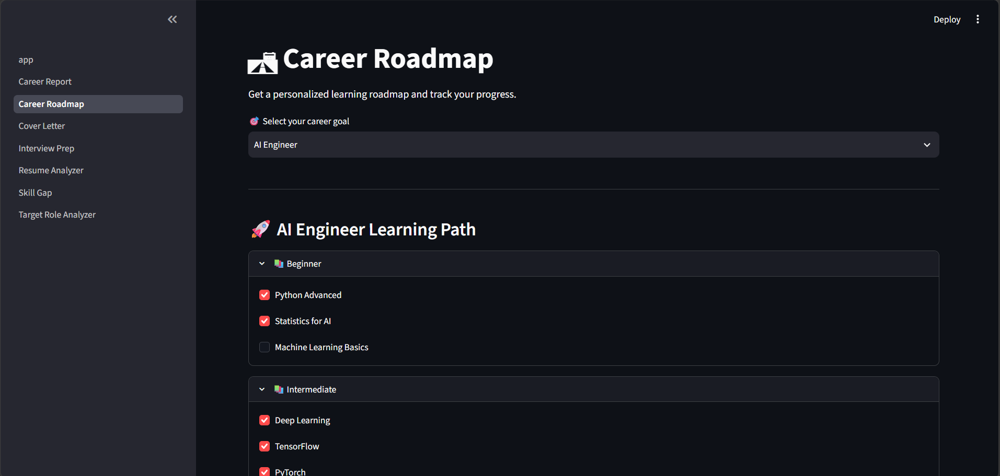
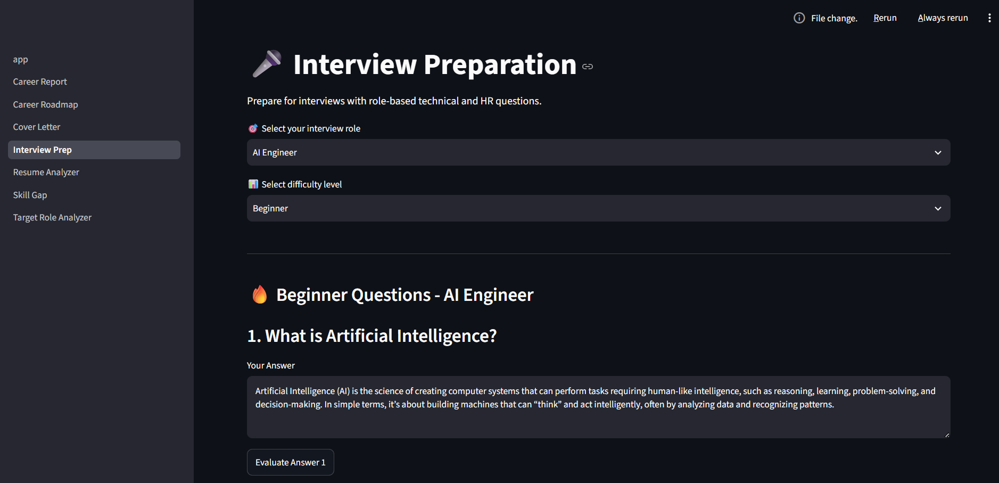
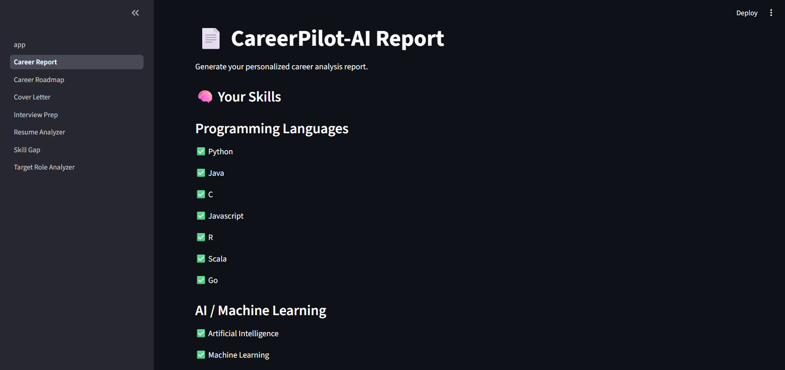
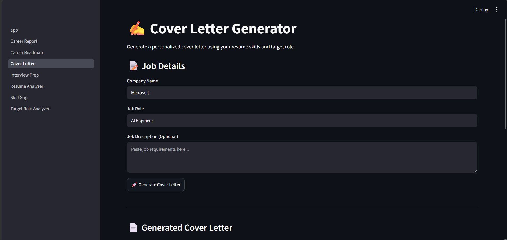

# 🚀 CareerPilot-AI

## Your Personal AI Career Mentor

CareerPilot-AI is an AI-powered career guidance platform that helps students and job seekers analyze their resumes, identify skill gaps, discover suitable career paths, prepare for interviews, and generate personalized career reports.

The system combines Resume Analysis, Machine Learning, Natural Language Processing, and AI-based recommendations to provide an end-to-end career preparation experience.

---

# ✨ Features

## 📄 Resume Analyzer

- Upload resume in PDF format
- Extract resume text automatically
- Calculate ATS compatibility score
- Extract technical skills
- Analyze resume strengths

---

## 🎯 Career Recommendation

- Suggests suitable career roles based on skills
- Provides role match percentage
- Identifies best-fit career paths

Supported roles:

- AI Engineer
- Machine Learning Engineer
- Data Scientist
- Data Analyst
- Full Stack Developer

---

## 🧠 Target Role Analyzer

Analyzes resume skills against the selected career role.

Provides:

- Matching skills
- Role compatibility score
- Missing skills
- Personalized improvement roadmap

---

## 📚 Skill Gap Analysis

Identifies missing skills required for the selected role.

Provides:

- Skill importance
- Learning topics
- Improvement suggestions

---

## 🛣 Career Roadmap

Provides a structured learning path:

- Beginner skills
- Intermediate skills
- Advanced skills

Tracks:

- Completed skills
- Learning progress
- Completion percentage

---

## 🎤 Interview Preparation

AI-based interview preparation module:

- Technical questions
- HR questions
- Answer evaluation
- Performance score
- Feedback generation

---

## 📑 Career Report

Generates a personalized career report containing:

- Resume ATS score
- Skills profile
- Career recommendations
- Target role analysis
- Skill gaps

Export available as PDF.

---

## ✍ Cover Letter Generator

Creates personalized cover letters based on:

- Target company
- Job role
- Resume skills
- Candidate profile

---

# 🏗 System Architecture

```
Resume Upload

⬇️

PDF Text Extraction

⬇️

Resume Analysis + Skill Extraction

⬇️

Career Recommendation Engine

⬇️

Role Matching + Skill Gap Detection

⬇️

Learning Roadmap

⬇️

Interview Preparation

⬇️

Career Report & Cover Letter Generation
```

---

# 🛠 Tech Stack

## Programming Language

- Python

## Frontend

- Streamlit

## Machine Learning

- Scikit-learn
- NLP techniques
- Rule-based recommendation system

## Data Processing

- Pandas
- NumPy

## Database

- SQLite

## PDF Processing

- PyPDF

## Report Generation

- ReportLab

## Version Control

- Git
- GitHub

---

# 📂 Project Structure

```text
CareerPilot-AI/

│
├── app.py
│
├── pages/
│   ├── Resume_Analyzer.py
│   ├── Target_Role_Analyzer.py
│   ├── Skill_Gap.py
│   ├── Career_Roadmap.py
│   ├── Interview_Prep.py
│   ├── Career_Report.py
│   └── Cover_Letter.py
│
├── utils/
│   ├── ats.py
│   ├── skills.py
│   ├── career.py
│   ├── role_analyzer.py
│   ├── interview_ai.py
│   └── pdf_parser.py
│
├── database/
│   ├── careerpilot.db
│   └── db_operations.py
│
└── requirements.txt
```

---

# ⚙ Installation

## Clone the repository

```bash
git clone https://github.com/anu-mahekar/CareerPilot-AI.git
```

## Navigate to project folder

```bash
cd CareerPilot-AI
```

## Create virtual environment

```bash
python -m venv venv
```

## Activate environment

Windows:

```bash
venv\Scripts\activate
```

## Install dependencies

```bash
pip install -r requirements.txt
```

## Run application

```bash
streamlit run app.py
```

---

# 🎯 Applications

- Student career guidance
- Resume improvement
- Interview preparation
- Skill development planning
- AI-assisted job preparation

---

# 🚀 Future Enhancements

- Integration with real job portals
- Advanced LLM-based career recommendations
- Resume improvement suggestions
- LinkedIn profile analysis
- Cloud deployment

---

# 🎥 Demo Video

Watch the complete working demo of CareerPilot-AI:

[▶ Click here to watch the demo](demo/CareerPilot_AI_Demo.mp4)

---

# 📸 Screenshots

## 🏠 Dashboard



---

## 📄 Resume Analyzer



---

## 🎯 Target Role Analyzer

.png)

---

## 🧠 Skill Gap Analysis

.png)

---

## 🛣 Career Roadmap



---

## 🎤 Interview Preparation



---

## 📑 Career Report



---

## ✍ Cover Letter Generator




# 👩‍💻 Author

**Anusha Ullas Mahekar**

B.E Artificial Intelligence & Machine Learning